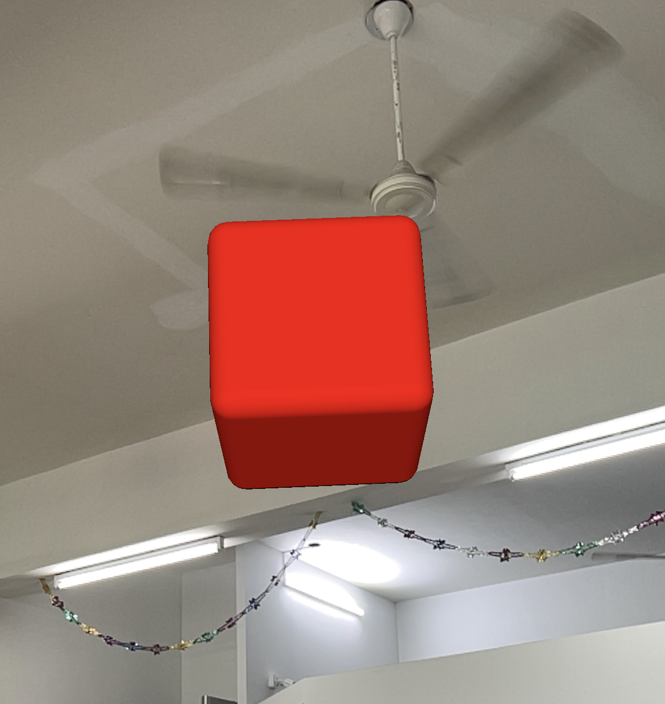
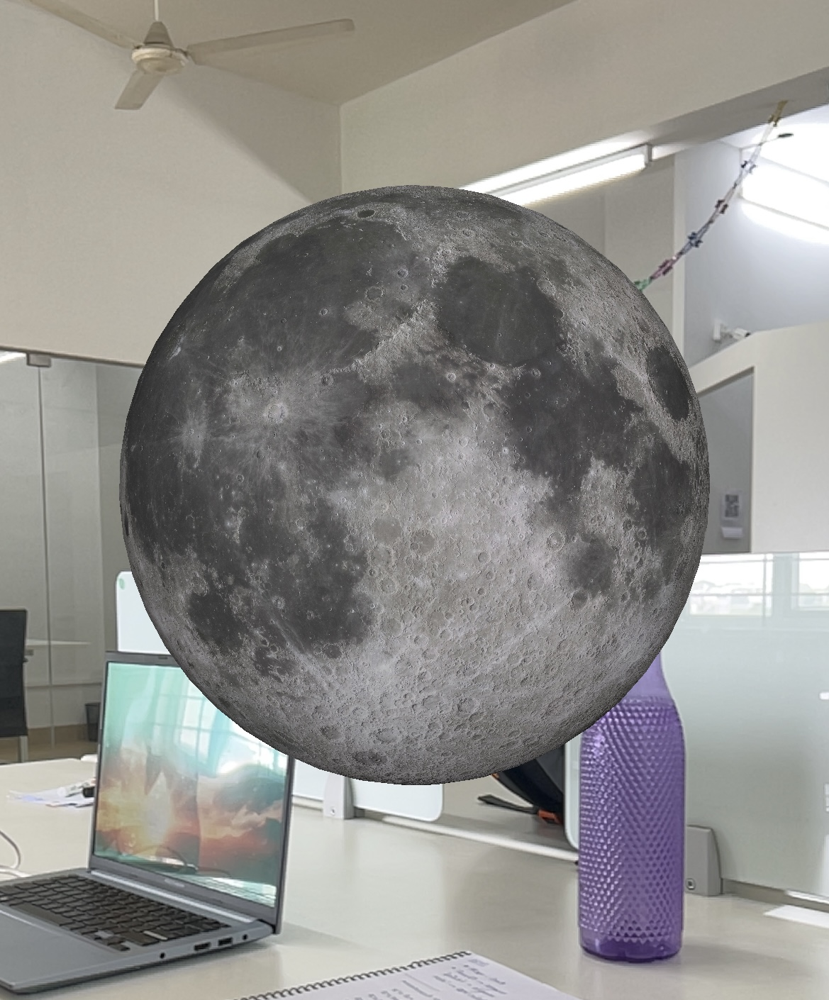
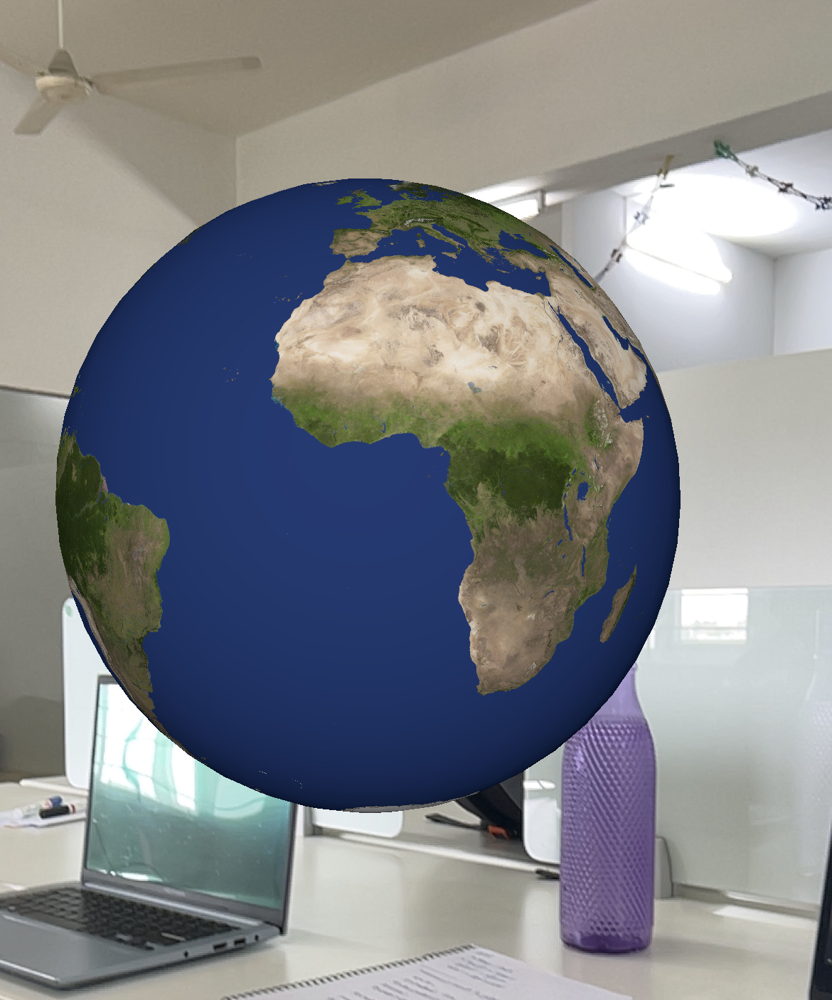
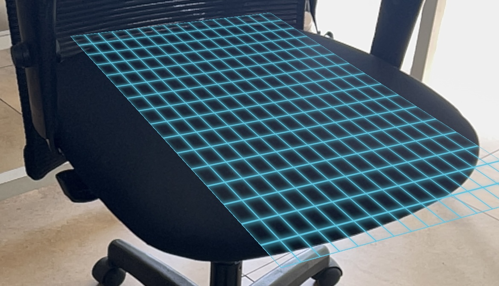
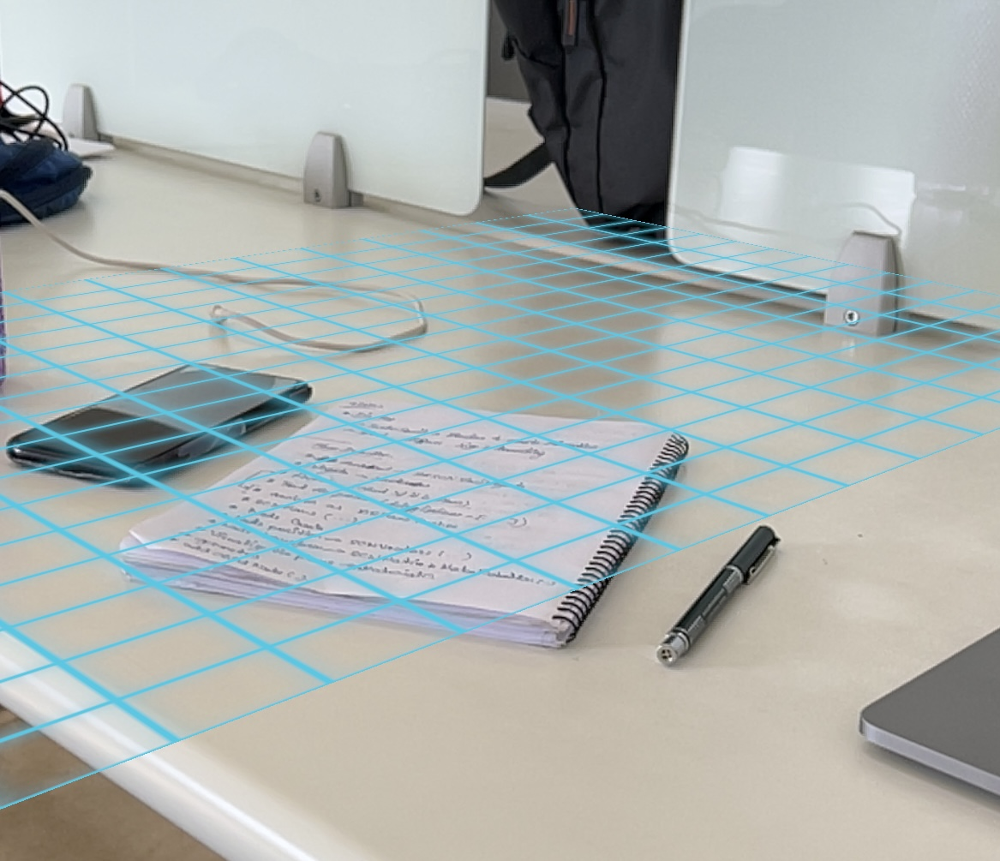
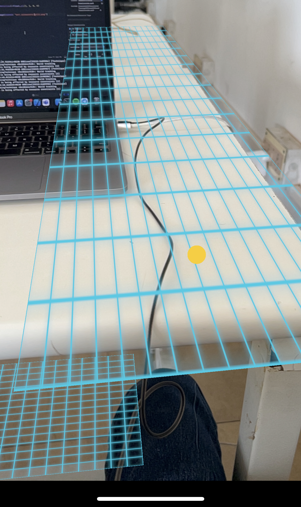

# ARDicee
Learning ARkit Basic in Swift with the Dice rolling app.

## Stage 1

### CREATING 3D OBJECT (Cube) 

### Code: 

```swift
import UIKit
import SceneKit
import ARKit

class ViewController: UIViewController, ARSCNViewDelegate {
    @IBOutlet var sceneView: ARSCNView!
    
    override func viewDidLoad() {
        super.viewDidLoad()
        
        sceneView.delegate = self
   
        let cube = SCNBox(width: 0.1, height: 0.1, length: 0.1, chamferRadius: 0.01)
        
        let material = SCNMaterial()
        material.diffuse.contents = UIColor.red
        
        cube.materials = [material]
        
        let node = SCNNode()
        node.position = SCNVector3(x:0 , y: 0.1, z: -0.5)
        node.geometry = cube
        
        sceneView.scene.rootNode.addChildNode(node)
        sceneView.autoenablesDefaultLighting = true
        
    }
    
    override func viewWillAppear(_ animated: Bool) {
        super.viewWillAppear(animated)
        
        // Create a session configuration
        let configuration = ARWorldTrackingConfiguration()

        // Run the view's session
        sceneView.session.run(configuration)
    }
    
    override func viewWillDisappear(_ animated: Bool) {
        super.viewWillDisappear(animated)
        
        // Pause the view's session
        sceneView.session.pause()
    }
}
```

### Output: (In Iphone 13 Pro)




## Stage 2

### CREATING 3D SPHERE OBJECTS (MOON & EARTH)

### Code:

```swift
let sphere = SCNSphere(radius: 0.2)

        let material = SCNMaterial()
        material.diffuse.contents = UIImage(named: "earth.jpg")
        
        sphere.materials = [material]
        
        let node = SCNNode()
        node.position = SCNVector3(x:0 , y: 0.1, z: -0.5)
        node.geometry = sphere
        
        sceneView.scene.rootNode.addChildNode(node)
        sceneView.autoenablesDefaultLighting = true
```

### Output: 

 


## Stage 3

### CREATING A SINGLE DICE AS SCENE VIEW

### Code:

```swift
let diceScene = SCNScene(named: "art.scnassets/diceCollada.scn")!
        
if let diceNode = diceScene.rootNode.childNode(withName: "Dice", recursively: true) {
    diceNode.position = SCNVector3(x:0, y:0, z:-0.1)
    sceneView.scene.rootNode.addChildNode(diceNode)
}
sceneView.autoenablesDefaultLighting = true
```

### Output:


## Stage 4

### HORIZONTRAL PLANE DETECTION

### Code:   [ViewController](ARDicee/ViewController.swift)

### Output:

  


## Stage 4

### DETECT TOUCH AND PLACE DICE ON THE TOUCHED HORIZONTAL PLANE

### Code:   [ViewController](ARDicee/ViewController.swift)

### Output:

 


## Stage 5

### MAKE THE 3D OBJECT ANIMATE (ROLL THE DICE - WITH REFRESH BUTTON AND WHEN SHAKE PHONE)

### Code:   [ViewController](ARDicee/ViewController.swift)

### Output:

https://user-images.githubusercontent.com/89236958/183870557-6374b1e9-29cc-401e-b3fe-7b7278667ec4.MP4

## Stage 6

### 

### Code:   [ViewController](ARDicee/ViewController.swift)

### Output:


